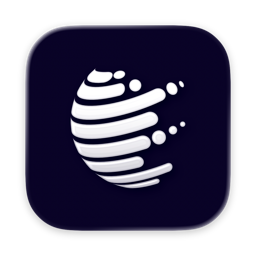

<p align="center">
  
</p>

<h1 align="center">Glossa</h1>

<p align="center">一款安静、纯粹的 macOS AI 词典。</p>

<p align="center">
  <a href="README.md">English</a> · <strong>简体中文</strong>
</p>

Glossa 只做三件事：查词、翻译和单词本。没有课程、信息流、一堆的静态词库，也拒绝往应用里塞一个浏览器。

彻底按照你的 Prompt 来定制查询内容，回归语言学习本质而不是假装成为语言学家。

> [!NOTE]
> 查词、翻译流和本地单词本已经实现。各服务商的真实请求覆盖、跨 App 交互和私有 iCloud 同步仍需验证。

## 为什么做 Glossa

- **保持纯粹。** 查词、翻译、收藏，仅此而已，不用在无关功能里分心。
- **你的 AI，你的表达。** 自由选择服务商、回复语言和模型，并为词典模式与翻译模式分别编写 Prompt。
- **尽量不打断阅读。** 在大多数 macOS App 中选中文字，按下快捷键，结果会出现在当前屏幕右上角的小面板中。无法直接读取选区时，Glossa 可以谨慎地使用复制回退；此功能需要辅助功能权限。
- **真正有用的单词本。** 保存查询结果、搜索过往记录、补充语境和可编辑的 AI 记忆笔记，也可以恢复删除内容，并通过可读的 `.glossawords` 文件导入或导出备份。
- **原生，也刻意保持轻量。** 使用 SwiftUI 与 Apple 原生框架，空闲时由事件驱动；没有第三方运行时依赖、分析统计、后台轮询或内置模型。
- **隐私优先。** API Key 保存在 macOS 钥匙串中。只有你主动查询、重试或创建 AI 笔记时，相关文本才会发送给所选服务商。

## 使用方式

1. 在其他 App 中选中文字并按 <kbd>⌥ A</kbd>；也可以按 <kbd>⌥ ⇧ A</kbd> 手动输入或粘贴。
2. Glossa 会选择合适的语言流，并判断应该查词还是翻译；两项都可以手动修改。
3. 配置好的 AI 服务会把 Markdown 结果流式显示在查词面板中。
4. 值得记住的内容可以直接存进单词本。

快捷键、语言流、Prompt、服务商和模型都可以在设置中修改。目前提供 DeepSeek、OpenAI、Gemini、Claude（实验性）、Qwen、Kimi、Grok 和 Mistral 预设，通过兼容 OpenAI Chat Completions 的接口工作。

## 单词本与 iCloud

本地单词本使用 SwiftData。每条收藏可以保留原始回答、来源 App、你补充的语境、简短释义和记忆提示。备份导入导出独立于同步，因此 iCloud 不会是你唯一的数据副本。

项目已经包含供正确签名版本使用的私有 CloudKit 集成，但真实双设备同步、离线冲突和账户切换仍需验证。普通本地构建只使用本地存储。

## 构建与运行

Glossa 需要 macOS 14 或更高版本，以及 Xcode 16 或更高版本。打开 `Glossa.xcodeproj`，选择 **Glossa** Scheme 和 **My Mac** 后运行即可。离线构建不需要安装任何 Package，也不需要环境文件或 API Key。

```sh
xcodebuild test -project Glossa.xcodeproj -scheme Glossa \
  -configuration Debug -destination 'platform=macOS' \
  -derivedDataPath build/DerivedData

xcodebuild build -project Glossa.xcodeproj -scheme Glossa \
  -configuration Release -destination 'generic/platform=macOS' \
  -derivedDataPath build/DerivedData
```

真实查询需要可用的服务商账户和 API Key。跨 App 读取选中文字还需要在 **系统设置 → 隐私与安全性 → 辅助功能** 中允许 Glossa。除非你在已忽略的 `Config/Local.xcconfig` 中加入个人签名配置，本地构建会使用临时签名。

## 项目状态

已经实现：

- 原生菜单栏 App、全局快捷键、选中文字查询和手动输入
- Markdown 流式结果、停止、重试、响应大小限制和小型内存缓存
- 按语言配置的词典与翻译流程，可分别设置服务商、模型和 Prompt
- 本地 SwiftData 单词本、可编辑 AI 笔记、可恢复删除和备份导入导出
- 供已配置签名版本使用的可选私有 CloudKit 配置

仍需验证：

- 所有内置服务商预设的真实请求
- Chrome、预览等代表性 App 中的选区读取和复制回退
- 正确签名后的双设备 iCloud 同步与冲突处理
- 键盘、VoiceOver、交互界面，以及当前 Release 版本的内存表现

静态词典、OCR、屏幕截图取词、课程、内嵌结果浏览器和本地模型运行时都不在项目范围内。

实现细节、安全限制、服务商行为和当前验证记录请查看英文版 [Technical notes](docs/technical-notes.md)。

## 参与开发

[CONTRIBUTING.md](CONTRIBUTING.md) 介绍了构建检查和项目约定；[AGENTS.md](AGENTS.md) 记录了开发时遵循的产品边界。

## 许可证

[MIT](LICENSE)
